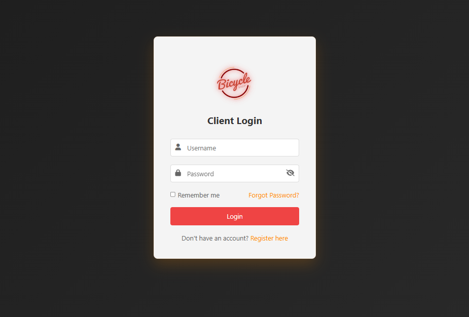

# Bicycle Shop Login Form 🚲
A PHP-based login system with modern interface and glowing logo animation for bicycle shop management.


## ✨ Features
- Server-side PHP authentication
- Secure session management
- Remember me functionality
- Password visibility toggle
- Glowing logo animation
- Error message display
- Clean dark theme interface
- Responsive design


## 🛠️ Technologies Used
- PHP 7.4+
- HTML5
- CSS3
- JavaScript
- Session Management
- Cookie Handling
- Font Awesome Icons

## 📁 Project Structure
```
Client Login Form
│
├── index.php
├── welcome.php
├── logout.php
├── style.css
├── README.md
│
└── assets/
    └── img/
        └── logo.png
```

## 🔐 Login System
1. Access the login form
2. Enter credentials (default: admin/password123)
3. Optional: Check "Remember Me"
4. Click login to authenticate
5. Successful login redirects to welcome page

## 🚀 Getting Started
1. Install XAMPP:
```bash
# Download and install from
https://www.apachefriends.org/
```

2. Place files in XAMPP directory:
```bash
C:/xampp/htdocs/bicycle-login/
```

3. Start Apache server:
```bash
# Using XAMPP Control Panel
Start Apache Module
```

4. Access the login form:
```bash
http://localhost/bicycle-login/
```

## 🎨 Logo Requirements
### logo.png

- Format: PNG with transparency
- Location: assets/img/logo.png

## 🔒 Security Features
- Server-side validation
- Session management
- Secure cookie handling


## 🔧 Customization
### Modifying Credentials
Edit in `index.php`:
```php
// Login credentials
$valid_username = "admin";
$valid_password = "password123";
```

### Adjusting Logo Animation
Edit in `style.css`:
```css
.logo {
    animation: glow 2s ease-in-out infinite alternate;
}
```


## 📝 License
This project is open source

## 👏 Acknowledgments
- Font Awesome for icons
- XAMPP development environment
- Modern login form inspiration

## 🐛 Known Issues
- Remember me duration fixed at 30 days
- No password reset functionality
- Single user authentication

